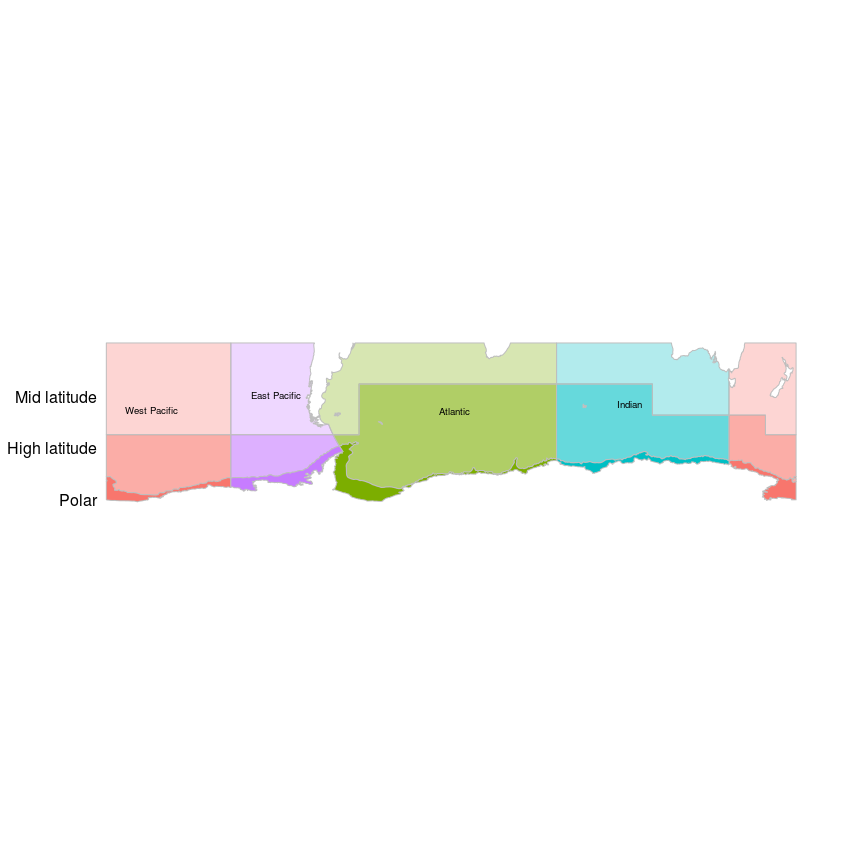
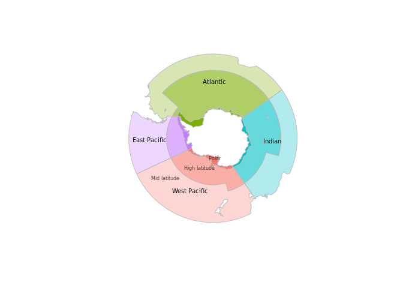
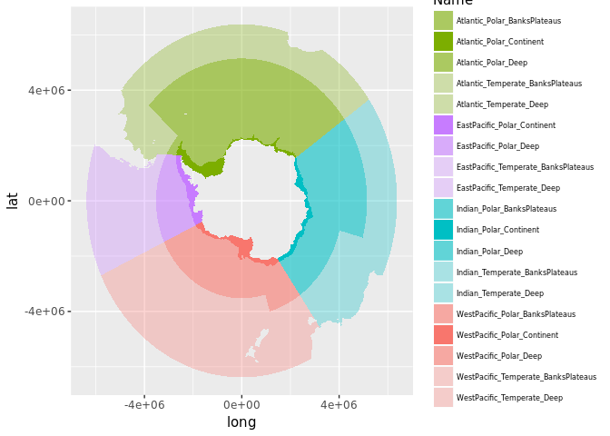

readme
================

[](https://travis-ci.org/AustralianAntarcticDivision/aceecostats)

[](https://ci.appveyor.com/project/AustralianAntarcticDivision/aceecostats)

<!-- README.md is generated from README.Rmd. Please edit that file -->
Install
-------

Install the package

``` r
devtools::install_github("AustralianAntarcticDivision/aceecostats")
```

Regions
-------

Get the regions.

``` r
library(aceecostats)
library(sp)
labs <- data.frame(x= c(112406,4488211,-1734264,-4785284), y=c(4271428,-224812,-3958297,-104377), labels=c("Atlantic","Indian", "West Pacific", "East Pacific"))
labs <- SpatialPointsDataFrame(labs[,1:2],labs, proj4string = CRS(proj4string(aes_region)))
plot(aes_region, col = aes_region$colour, border="grey")
text(labs$x, labs$y, labs$labels, cex=0.6)

# latitude zone labels
lat.labs<- function(the.proj="polar"){
  if(the.proj=="latlon"){
    ext <- extent(aes_region_ll)
    text("Polar", x=ext@xmin, y=ext@ymin, xpd=NA, pos=2, cex=0.6)
    text("High latitude", x=ext@xmin, y=ext@ymin*0.8, xpd=NA, pos=2, cex=0.6)
    text("Mid latitude", x=ext@xmin, y=ext@ymin*0.6, xpd=NA, pos=2, cex=0.6)
  }
  if(the.proj=="polar"){
    text(c("Polar", "High latitude", "Mid latitude"), x=c(113064.6,-1017581.1,-3642294), y=c(-1518296,-2285519,-3012363), cex=0.5, col=rgb(0,0,0,0.7))
  }
}
lat.labs()
```


In unprojected form.

``` r
library(aceecostats)
library(raster)
library(sp)
plot(aes_region_ll, col = aes_region_ll$colour, border="grey")
ll_labs <- spTransform(labs, CRS(proj4string(aes_region_ll)))
text(ll_labs$x, ll_labs$y, labels=labs$labels, cex=0.6)
lat.labs("latlon")
```



Simplified regions
------------------

``` r
plot(aes_region_simple, col = aes_region_simple$colour, border="grey")
text(labs$x, labs$y, labels=labs$labels, cex=0.6)
lat.labs()
```



Write to shapefile.

``` r
shapefile(aes_region, "my_aes_region.shp")
```

(Leave your money on the fridge).

Metadata
--------

The data is stored on the map object itself.

``` r
knitr::kable(as.data.frame(aes_region))
```

|     |   ID| BathyClass    | SectorName  | Zone      | Name                                  | Shelf |    area\_km2| colour     |
|-----|----:|:--------------|:------------|:----------|:--------------------------------------|:------|------------:|:-----------|
| 47  |    1| BanksPlateaus | Atlantic    | Polar     | Atlantic\_Polar\_BanksPlateaus        | Ocean |    501423.64| \#7CAE0099 |
| 48  |    2| Continent     | Atlantic    | Polar     | Atlantic\_Polar\_Continent            | Shelf |   1084547.95| \#7CAE00FF |
| 49  |    3| Deep          | Atlantic    | Polar     | Atlantic\_Polar\_Deep                 | Ocean |  19353773.36| \#7CAE0099 |
| 50  |    4| BanksPlateaus | Atlantic    | Temperate | Atlantic\_Temperate\_BanksPlateaus    | Ocean |   2108929.34| \#7CAE004D |
| 51  |    5| Deep          | Atlantic    | Temperate | Atlantic\_Temperate\_Deep             | Ocean |  13562422.11| \#7CAE004D |
| 52  |    6| Continent     | EastPacific | Polar     | EastPacific\_Polar\_Continent         | Shelf |    724857.54| \#C77CFFFF |
| 53  |    7| Deep          | EastPacific | Polar     | EastPacific\_Polar\_Deep              | Ocean |   3241353.36| \#C77CFF99 |
| 54  |    8| BanksPlateaus | EastPacific | Temperate | EastPacific\_Temperate\_BanksPlateaus | Ocean |    405139.12| \#C77CFF4D |
| 55  |    9| Deep          | EastPacific | Temperate | EastPacific\_Temperate\_Deep          | Ocean |  10168793.90| \#C77CFF4D |
| 56  |   10| BanksPlateaus | Indian      | Polar     | Indian\_Polar\_BanksPlateaus          | Ocean |    676845.57| \#00BFC499 |
| 57  |   11| Continent     | Indian      | Polar     | Indian\_Polar\_Continent              | Shelf |    706453.81| \#00BFC4FF |
| 58  |   12| Deep          | Indian      | Polar     | Indian\_Polar\_Deep                   | Ocean |  11022311.32| \#00BFC499 |
| 59  |   13| BanksPlateaus | Indian      | Temperate | Indian\_Temperate\_BanksPlateaus      | Ocean |    694668.93| \#00BFC44D |
| 60  |   14| Deep          | Indian      | Temperate | Indian\_Temperate\_Deep               | Ocean |  12373702.76| \#00BFC44D |
| 61  |   15| BanksPlateaus | WestPacific | Polar     | WestPacific\_Polar\_BanksPlateaus     | Ocean |     32840.05| \#F8766D99 |
| 62  |   16| Continent     | WestPacific | Polar     | WestPacific\_Polar\_Continent         | Shelf |    885409.00| \#F8766DFF |
| 63  |   17| Deep          | WestPacific | Polar     | WestPacific\_Polar\_Deep              | Ocean |   8103336.24| \#F8766D99 |
| 64  |   18| BanksPlateaus | WestPacific | Temperate | WestPacific\_Temperate\_BanksPlateaus | Ocean |   2552842.08| \#F8766D4D |
| 65  |   19| Deep          | WestPacific | Temperate | WestPacific\_Temperate\_Deep          | Ocean |  20472658.20| \#F8766D4D |

Prefer ggplot2?
---------------

``` r
## TODO fix this code
library(ggplot2)
library(ggpolypath)
tab <- fortify(aes_region)
```

    ## Regions defined for each Polygons

``` r
zcols <- as.data.frame(aes_region)[, c("colour", "Name", "ID")]
tab$Name <- zcols$Name[factor(tab$id)]
ggplot(tab) + aes(x = long, y = lat, group = group, fill = Name) + scale_fill_manual(values = setNames(zcols$colour, zcols$Name)) + 
geom_polypath() + theme(legend.text=element_text(size=6)) + guides(position = "bottom")
```


