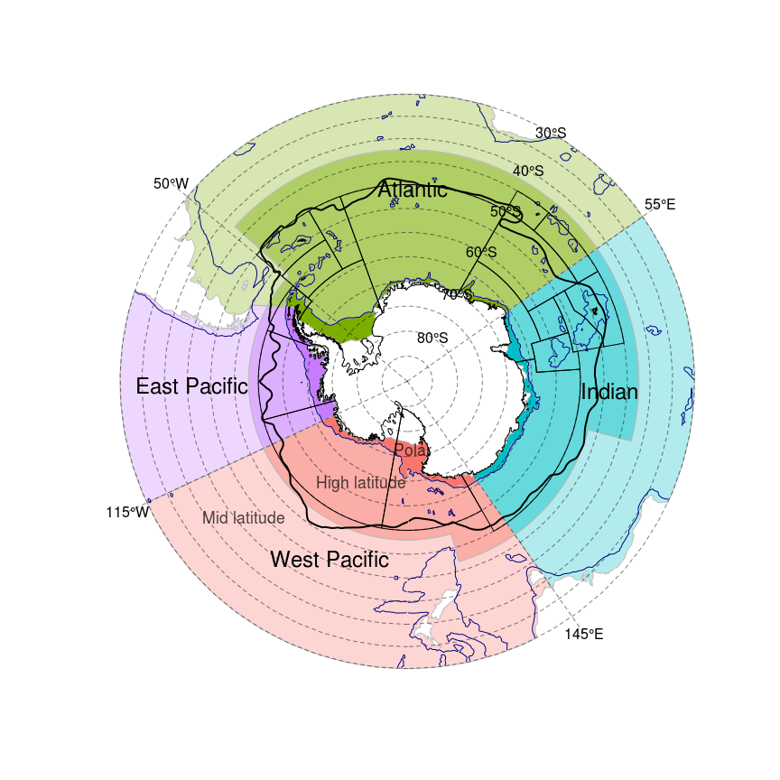
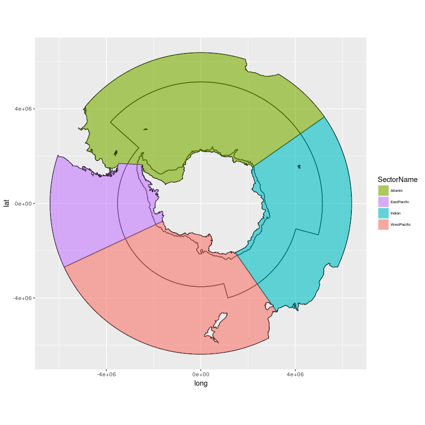

readme
================

[](https://travis-ci.org/AustralianAntarcticDivision/aceecostats)

[](https://ci.appveyor.com/project/AustralianAntarcticDivision/aceecostats)

<!-- README.md is generated from README.Rmd. Please edit that file -->
Processing Workflow
-------------------

This is in-progress, current map of the entire process is here: <https://github.com/AustralianAntarcticDivision/aceecostats/issues/14>

Install
-------

Install the package

``` r
devtools::install_github("AustralianAntarcticDivision/aceecostats")
```

Regions
-------

Get the regions.

``` r
library(aceecostats)
library(sp)
labs <- data.frame(x= c(112406,4488211,-1734264,-4785284), y=c(4271428,-224812,-3958297,-104377), labels=c("Atlantic","Indian", "West Pacific", "East Pacific"))
labs <- SpatialPointsDataFrame(labs[,1:2],labs, proj4string = CRS(proj4string(aes_zone)))
plot(aes_zone, col = aes_zone$colour, border="grey")
text(labs$x, labs$y, labs$labels, cex=0.6)

# latitude zone labels
lat.labs<- function(the.proj="polar"){
  if(the.proj=="latlon"){
    ext <- extent(aes_zone_ll)
    text("Polar", x=ext@xmin, y=ext@ymin, xpd=NA, pos=2, cex=0.6)
    text("High latitude", x=ext@xmin, y=ext@ymin*0.8, xpd=NA, pos=2, cex=0.6)
    text("Mid latitude", x=ext@xmin, y=ext@ymin*0.6, xpd=NA, pos=2, cex=0.6)
  }
  if(the.proj=="polar"){
    text(c("Polar", "High latitude", "Mid latitude"), x=c(113064.6,-1017581.1,-3642294), y=c(-1518296,-2285519,-3012363), cex=0.5, col=rgb(0,0,0,0.7))
  }
}
lat.labs()
```



In unprojected form.

``` r
library(aceecostats)
library(raster)
library(sp)
plot(aes_zone_ll, col = aes_zone_ll$colour, border="grey")
ll_labs <- spTransform(labs, CRS(proj4string(aes_zone_ll)))
text(ll_labs$x, ll_labs$y, labels=labs$labels, cex=0.6)
lat.labs("latlon")
```


Metadata
--------

The data is stored on the map object itself.

``` r
knitr::kable(as.data.frame(aes_zone))
```

| SectorName  | Zone          |   area\_km2| colour     |   ID|
|:------------|:--------------|-----------:|:-----------|----:|
| Atlantic    | High-Latitude |  19855197.0| \#7CAE0099 |    1|
| Atlantic    | Continent     |   1084548.0| \#7CAE00FF |    2|
| Atlantic    | Mid-Latitude  |  15671351.4| \#7CAE004D |    3|
| EastPacific | High-Latitude |   3241353.4| \#C77CFF99 |    4|
| EastPacific | Continent     |    724857.5| \#C77CFFFF |    5|
| EastPacific | Mid-Latitude  |  10573933.0| \#C77CFF4D |    6|
| Indian      | High-Latitude |  11699156.9| \#00BFC499 |    7|
| Indian      | Continent     |    706453.8| \#00BFC4FF |    8|
| Indian      | Mid-Latitude  |  13068371.7| \#00BFC44D |    9|
| WestPacific | High-Latitude |   8136176.3| \#F8766D99 |   10|
| WestPacific | Continent     |    885409.0| \#F8766DFF |   11|
| WestPacific | Mid-Latitude  |  23025500.3| \#F8766D4D |   12|

Prefer ggplot2?
---------------

``` r
## TODO fix this code
library(ggplot2)
library(ggpolypath)
tab <- fortify(aes_zone)
```

    ## Regions defined for each Polygons

``` r
zcols <- as.data.frame(aes_zone)[, c("colour", "SectorName", "Zone")]
tab$SectorName <- zcols$SectorName[factor(tab$id)]
ggplot(tab) + aes(x = long, y = lat, group = group, fill = SectorName) + scale_fill_manual(values = setNames(zcols$colour, zcols$SectorName)) + geom_path() + 
geom_polypath() + theme(legend.text=element_text(size=6)) + guides(position = "bottom") + coord_equal()
```


