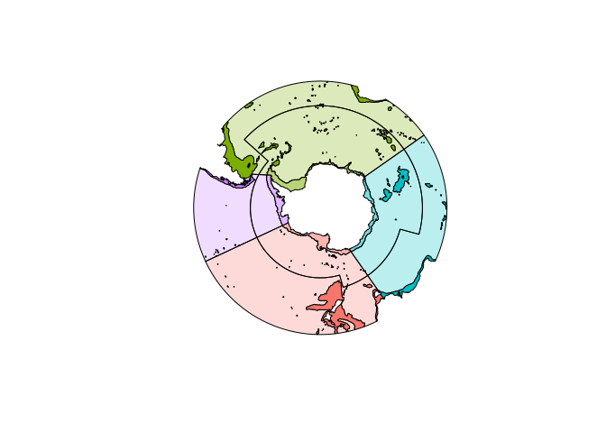
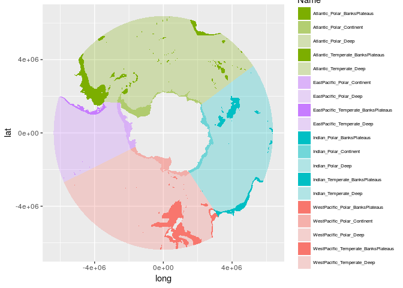

<!-- README.md is generated from README.Rmd. Please edit that file -->
Install
-------

Install the package

``` r
devtools::install_github("AustralianAntarcticDivision/aceecostats")
```

Regions
-------

Get the regions.

``` r
library(aceecostats)
library(sp)
plot(aes_region, col = aes_region$colour)
```



In unprojected form.

``` r
library(aceecostats)
library(sp)
plot(aes_region_ll, col = aes_region_ll$colour)
```


Write to shapefile.

``` r
library(raster)
shapefile(aes_region, "my_aes_region.shp")
```

(Leave your money on the fridge).

Metadata
--------

The data is stored on the map object itself.

``` r
knitr::kable(as.data.frame(aes_region))
```

|     |   ID| BathyClass    | SectorName  | Zone      | Name                                  |    area\_km2| colour     |
|-----|----:|:--------------|:------------|:----------|:--------------------------------------|------------:|:-----------|
| 47  |    1| BanksPlateaus | Atlantic    | Polar     | Atlantic\_Polar\_BanksPlateaus        |    501423.64| \#7CAE00FF |
| 48  |    2| Continent     | Atlantic    | Polar     | Atlantic\_Polar\_Continent            |   1084547.95| \#7CAE0088 |
| 49  |    3| Deep          | Atlantic    | Polar     | Atlantic\_Polar\_Deep                 |  19353773.36| \#7CAE0044 |
| 50  |    4| BanksPlateaus | Atlantic    | Temperate | Atlantic\_Temperate\_BanksPlateaus    |   2108929.34| \#7CAE00FF |
| 51  |    5| Deep          | Atlantic    | Temperate | Atlantic\_Temperate\_Deep             |  13562422.11| \#7CAE0044 |
| 52  |    6| Continent     | EastPacific | Polar     | EastPacific\_Polar\_Continent         |    724857.54| \#C77CFF88 |
| 53  |    7| Deep          | EastPacific | Polar     | EastPacific\_Polar\_Deep              |   3241353.36| \#C77CFF44 |
| 54  |    8| BanksPlateaus | EastPacific | Temperate | EastPacific\_Temperate\_BanksPlateaus |    405139.12| \#C77CFFFF |
| 55  |    9| Deep          | EastPacific | Temperate | EastPacific\_Temperate\_Deep          |  10168793.90| \#C77CFF44 |
| 56  |   10| BanksPlateaus | Indian      | Polar     | Indian\_Polar\_BanksPlateaus          |    676845.57| \#00BFC4FF |
| 57  |   11| Continent     | Indian      | Polar     | Indian\_Polar\_Continent              |    706453.81| \#00BFC488 |
| 58  |   12| Deep          | Indian      | Polar     | Indian\_Polar\_Deep                   |  11022311.32| \#00BFC444 |
| 59  |   13| BanksPlateaus | Indian      | Temperate | Indian\_Temperate\_BanksPlateaus      |    694668.93| \#00BFC4FF |
| 60  |   14| Deep          | Indian      | Temperate | Indian\_Temperate\_Deep               |  12373702.76| \#00BFC444 |
| 61  |   15| BanksPlateaus | WestPacific | Polar     | WestPacific\_Polar\_BanksPlateaus     |     32840.05| \#F8766DFF |
| 62  |   16| Continent     | WestPacific | Polar     | WestPacific\_Polar\_Continent         |    885409.00| \#F8766D88 |
| 63  |   17| Deep          | WestPacific | Polar     | WestPacific\_Polar\_Deep              |   8103336.24| \#F8766D44 |
| 64  |   18| BanksPlateaus | WestPacific | Temperate | WestPacific\_Temperate\_BanksPlateaus |   2552842.08| \#F8766DFF |
| 65  |   19| Deep          | WestPacific | Temperate | WestPacific\_Temperate\_Deep          |  20472658.20| \#F8766D44 |

Prefer ggplot2?
---------------

``` r

## TODO fix this code
library(ggplot2)
library(ggpolypath)
tab <- fortify(aes_region)
#> Regions defined for each Polygons
zcols <- as.data.frame(aes_region)[, c("colour", "Name", "ID")]
tab$Name <- zcols$Name[factor(tab$id)]
ggplot(tab) + aes(x = long, y = lat, group = group, fill = Name) + scale_fill_manual(values = setNames(zcols$colour, zcols$Name)) + 
  geom_polypath() + theme(legend.text=element_text(size=6)) + guides(position = "bottom")
```


